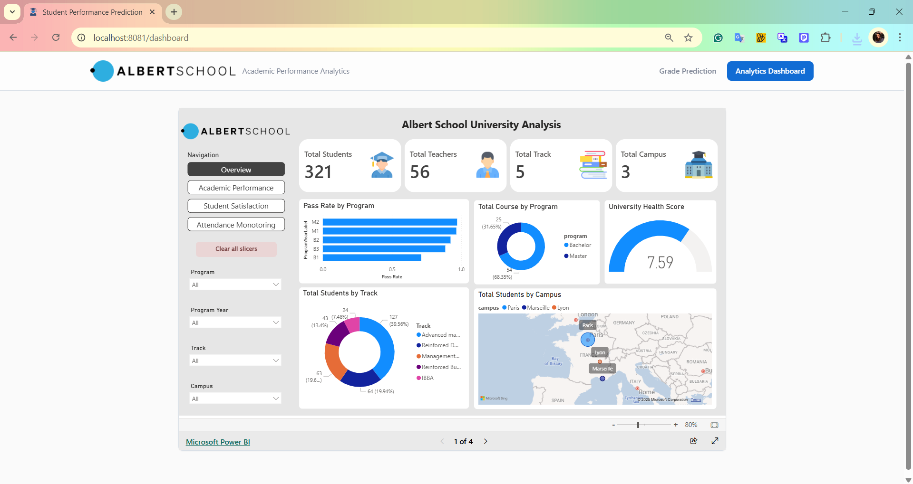
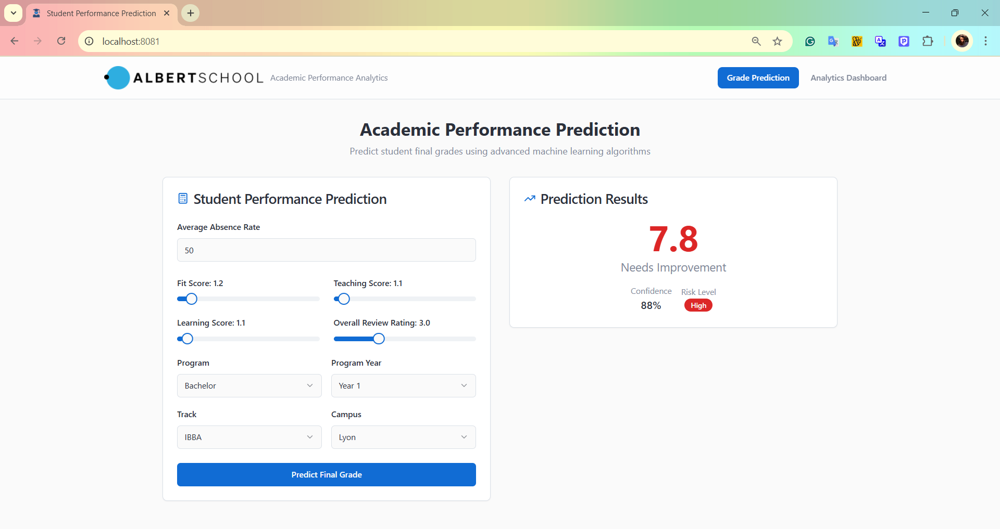

# 🎓 Student Performance Prediction Web App

This project is a full-stack machine learning web app designed to:

1. 📊 Visualize student performance and trends via an interactive **Power BI dashboard**
2. 🤖 Predict a student's **average score** based on academic and behavioral features using an **XGBoost model**

---

## 🔧 Tech Stack

| Layer       | Tool            |
|-------------|-----------------|
| Frontend    | React + Vite ⚡ |
| Backend     | FastAPI 🐍      |
| ML Model    | XGBoost         |
| Data Viz    | Power BI 📊     |
| Data Format | JSON / Pandas   |

---

## 🖼️ Screenshots

### 📊 Power BI Dashboard Page

Displays key insights like:
- Distribution of average scores
- Correlations between features
- Absences vs. performance
- Program-wise breakdowns



---

### 🤖 ML Prediction Web App

Allows users to:
- Input student features (e.g., fit score, review rating, absence rate)
- Submit the form
- Instantly receive the **predicted average score**



---

## ⚙️ Project Structure

StudentPrediction/
├── backend/
│ ├── main.py # FastAPI backend
│ └── best_model.pkl # Trained XGBoost model
├── frontend/
│ └── (React + Vite app)


---

## 🚀 How to Run the App Locally

### 1. Clone the Repository

```bash
git clone https://github.com/your-username/StudentPrediction.git
cd StudentPrediction 

### 2. Run Backend (FastAPI)

```bash
cd backend
pip install -r requirements.txt
uvicorn main:app --reload
```

This will start the backend server at http://localhost:8000

### 3. Run Frontend (React + Vite)
```bash
cd frontend
npm install
npm run dev
```

The frontend will open at http://localhost:5173

## 🧠 Machine Learning Model
• Trained on real student performance data
• Missing values handled with KNN imputation
• Feature encoding via One-Hot Encoding
• Model: XGBoostRegressor
• Best model chosen based on R² score
• Deployed using joblib and loaded in FastAPI
